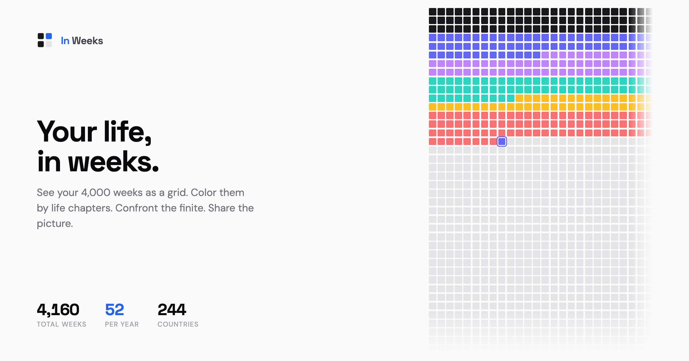

<div align="center">


# In Weeks

**Your life, in weeks.**

Visualize your entire life as a grid of ~4,000 weeks. See how many you've lived, how many remain, and color them by life chapters.

[**inweeks.org**](https://inweeks.org)



</div>

---

## What is this?

Inspired by Tim Urban's [Your Life in Weeks](https://waitbutwhy.com/2014/05/life-weeks.html), this is the interactive version. Enter your birthday, pick your country, and see your life laid out as a grid — every square is one week. The lived ones are filled. The empty ones aren't.

You can color weeks by life chapters (school, career, travel, etc.) and export a portrait image to share.

## Features

- **244 countries** with life expectancy data from the UN World Population Prospects
- **Interactive canvas grid** — animated reveal of every week of your life
- **Life chapters** with a curated 10-color palette
- **Shareable image** — 1080x1920 portrait card, perfect for stories
- **Dark mode**
- **100% client-side** — no account, no tracking, no server. Your data lives in `localStorage`.
- **Fully responsive** — works edge-to-edge from 320px to 4K
- **Accessible** — keyboard nav, focus states, `prefers-reduced-motion` support

## Tech stack

- **React 19** + **TypeScript**
- **Vite** for build
- **CSS Modules** + custom design system (no UI libraries)
- **Canvas** for the week grid (~4,000 squares animated at 60fps)
- **html-to-image** for share card export
- **Lucide** for icons

Total bundle: ~84KB gzipped.

## Run locally

```bash
git clone https://github.com/zeck00/inweeks.git
cd inweeks
npm install
npm run dev
```

Then open http://localhost:5173.

## Build

```bash
npm run build      # outputs to dist/
npm run preview    # preview the production build
```

## Regenerate the OG image

```bash
npm run generate:og
```

## Contributing

PRs welcome. Open an issue first if you're planning something big.

Some ideas:
- More chapter color palettes
- Country-specific gender life expectancy refinements
- Additional share card formats (square, landscape)
- Localization

## Privacy

In Weeks runs entirely in your browser. Your birthday, country, and chapters are stored only in your browser's `localStorage`. Nothing is ever sent to a server. There are no cookies and no analytics.

## License

[MIT](LICENSE) - Ziad

## Acknowledgements

Inspired by Tim Urban's *Your Life in Weeks* on Wait But Why and the book *Four Thousand Weeks* by Oliver Burkeman.
